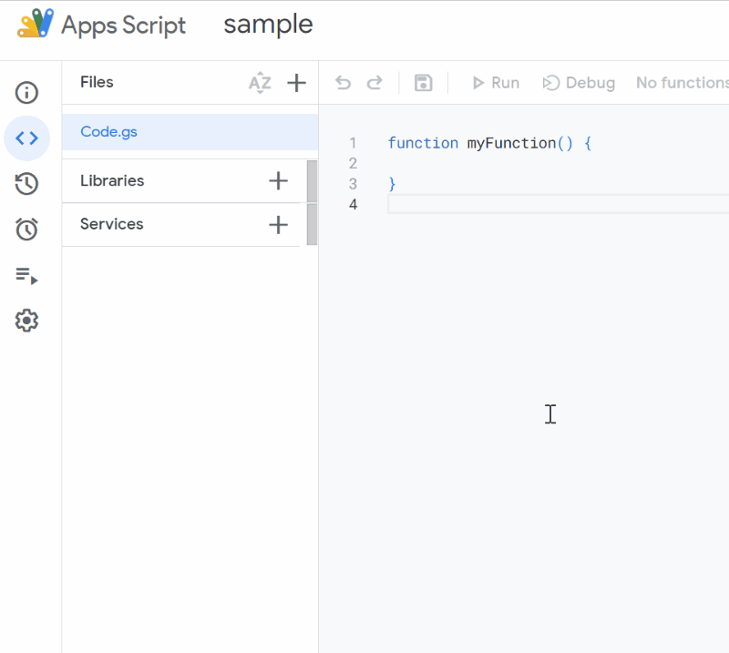
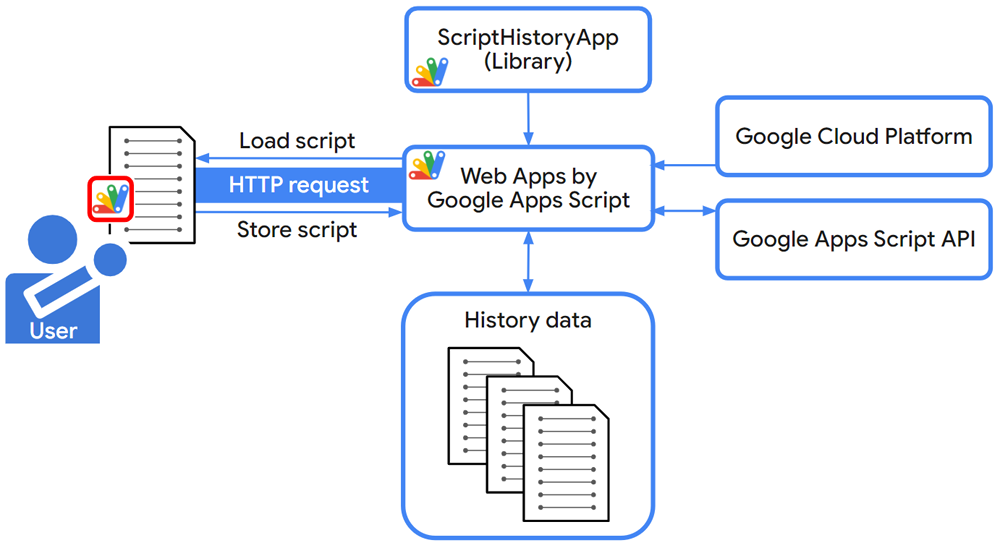
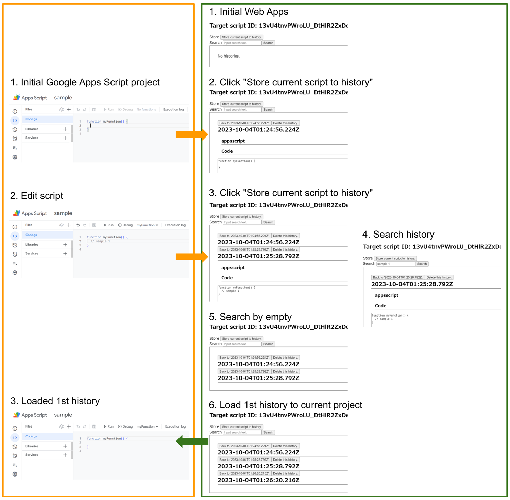

# ScriptHistoryApp

<a name="top"></a>
[MIT License](LICENCE)

<a name="overview"></a>

# Overview

This is a Google Apps Script library for managing the histories of the Google Apps Script project.



<a name="description"></a>

# Description

On August 23, 2023, the project history has been implemented in the new IDE of Google Apps Script. [Ref](https://developers.google.com/apps-script/docs/release-notes#August_23_2023) and [Ref](https://workspaceupdates.googleblog.com/2023/08/apps-script-project-history.html) In the current stage, the users can see the history of the previously deployed script version. This is a very important implementation for a lot of developers.

Here, I remember the classic IDE. In the case of the classic IDE, the users had been able to see the previously saved script version regardless of the deployment and just the save of the script. This is not implemented in the new IDE. I would like to expect that this will be implemented in the future update.

In the current stage, when we manually deploy the Google Apps Script project, several processes are required to be done. I think that when this deployment process is run every save, the cost will be high. On the other hand, when this process is trying to be run with ["Method: projects.deployments.create"](https://developers.google.com/apps-script/api/reference/rest/v1/projects.deployments/create) of Google Apps Script API, unfortunately, in the current stage, it seems that the script cannot be deployed as a new version because of the error. I'm not sure whether this is a bug or the current specification.

In such a situation, in order to simply manage the history of the script, I created a Google Apps Script library for achieving this using Google Apps Script API and Web Apps with Google Apps Script. In this report, I would like to introduce this.

# Library's project key

```
1s4_fkukUBz2lmxi3hlpjTqrJ-KVpVa_v9kV3qxUvymFiGtF66qUX5yFt
```

# Scopes

This library uses the following 3 scopes.

- `https://www.googleapis.com/auth/script.external_request`
- `https://www.googleapis.com/auth/drive`
- `https://www.googleapis.com/auth/script.projects`

<a name="usage"></a>

# Flow of this library



This library is used in Web Apps created by Google Apps Script. The Google Apps Script project with deploying Web Apps is linked with the Google Cloud Platform project, and the history data is managed using Google Apps Script API. By this, the history of all Google Apps Script projects in the same account can be managed using the Web Apps.

# Methods

| Methods | Description                                                          |
| :------ | :------------------------------------------------------------------- |
| server  | This method manages the histories of the Google Apps Script project. |

Currently, there is only one method `server` in this library. The method of `server` is used for managing the histories of the Google Apps Script projects.

# Usage

This is an important section. In order to use this library, it is required to do the following flow.

## 1. Create 2 Google Apps Script projects

1. Create a standalone Google Apps Script project. The filename is `Library`.

   - This Google Apps Script project is used as a server for using Google Apps Script API.

2. Create a standalone Google Apps Script project. The filename is `Client`.
   - The history of this script is recorded.

This is a simple sample. Of course, you can use the container-bound script type.

## 2. Open the “Library” file and link “Library” with the Google Cloud Platform

You can see how to link the Google Apps Script Project with the Google Cloud Platform Project at [here](https://github.com/tanaikech/Linking-Google-Cloud-Platform-Project-to-Google-Apps-Script-Project-for-New-IDE).

When I tested this flow, I confirmed that this library could be used correctly.

## 3. Enable APIs

Please enable the following APIs at the API console.

- Google Apps Script API
- Google Drive API

**When Drive API is not enabled, an error like `Error: Exception: We're sorry, a server error occurred. Please wait a bit and try again.` occurs. Please be careful about this.**

## 4. Enable change of Google Apps Script project

Please access to [https://script.google.com/home/usersettings](https://script.google.com/home/usersettings) using your browser and please change to "ON" for "Google Apps Script API" at "Settings". When you have already done this, this process can be skipped.

**When this is not enabled, even when the selected history is loaded, the history is not loaded. Please be careful about this.**

## 5. Install this library to the “Library” file

Please install this library to the Google Apps Script Project of the “Library” file. You can see how to install the library at "[the official document](https://developers.google.com/apps-script/guides/libraries)".

The library's project key is as follows.

```
1s4_fkukUBz2lmxi3hlpjTqrJ-KVpVa_v9kV3qxUvymFiGtF66qUX5yFt
```

## 6. Sample script for “Library”

The script for the "Library" file is very simple. Please copy and paste the following script to the “Library” file.

```javascript
// You can get the Web Apps URL when this function is run.
const getUrl = (_) => console.log(ScriptApp.getService().getUrl());

// This function is run by HTTP requesting. So, please don't directly run this function.
const doGet = (e) => ScriptHistoryApp.server(e);
```

Please give the event object from `doGet` to `ScriptHistoryApp.server` as the above script.

## 7. Deploy Web Apps

Please deploy Web Apps on the “Library” file.

The detailed information can be seen in [the official document](https://developers.google.com/apps-script/guides/web#deploy_a_script_as_a_web_app).

1. On the script editor, at the top right of the script editor, please click "click Deploy" -> "New deployment".
2. Please click "Select type" -> "Web App".
3. Please input the information about the Web App in the fields under "Deployment configuration".
4. Please select **"Me"** for **"Execute as"**.
5. Please select **"Only myself"** for **"Who has access"**.
6. Please click "Deploy" button.
7. Please run the function `getUr()` of the above script. By this, you can see your Web Apps URL. It’s like `https://script.google.com/macros/s/###/dev`. Please copy this URL. This URL is used on the client side.

By this flow, the preparation for using this library is finished.

## 8. Open “Client” file and prepare a sample script

**The history of this Google Apps Script project is saved.**

Please freely develop your script here.

# Testing

This section introduces the method for managing the history of the client Google Apps Script project using the deployed Web Apps in the above section. In this library, there are 2 approaches for managing the histories of the Google Apps Script projects.

**In the above section, a sample client like "Client" is used. Of course, you can also manage the existing Google Apps Script project. But, first, please test this library. Because when the old history is loaded, the Google Apps Script project is overwritten by the old history. Please be careful about this.**

## A. Manage with a script.

### A - 1. Store current Google Apps Script project in a database of history

This sample script is used for storing the current Google Apps Script project in a database of history. Please copy and paste the following script to the “Client” file.

In this case, I thought that when this script is added to a new script in the “Client” file, it might help to store the current scripts soon.

```javascript
function sample1() {
  const webAppsUrl = "https://script.google.com/macros/s/###/dev"; // Please set your Web Apps URL.
  const folderId = "###"; // Please set the folder ID. The history data is put into this folder.

  const scriptId = ScriptApp.getScriptId(); // Script ID (file ID of this Google Apps Script project) is set.
  const process = "store"; // This is a key for storing new history.
  const headers = { authorization: "Bearer " + ScriptApp.getOAuthToken() };
  const url = `${webAppsUrl}?scriptId=${scriptId}&folderId=${folderId}&process=${process}`;
  const res = UrlFetchApp.fetch(url, { headers }).getContentText();
  console.log(res);
}
```

When your Web Apps is correctly deployed, when you run this script, the current Google Apps Script project is stored in the database of history. The following response is returned.

```
Save as 2023-10-01T01:23:45.000Z
```

In this case, the value of `2023-10-01T01:23:45.000Z` is used as the ID of history.

### A - 2. Get the history of the current Google Apps Script project from a database as JSON

This sample script is used for retrieving the history of the current Google Apps Script project from a database of history. Please copy and paste the following script to the “Client” file.

In this case, I thought that when this script is added to a new script in the “Client” file, it might help to manage the history.

```javascript
function sample2() {
  const webAppsUrl = "https://script.google.com/macros/s/###/dev"; // Please set your Web Apps URL.
  const folderId = "###"; // Please set the folder ID. The history data is put into this folder.

  const scriptId = ScriptApp.getScriptId(); // Script ID (file ID of this Google Apps Script project) is set.
  const search = ""; // If you want to filter the response value, please set this.
  const process = "getHistories"; // This is a key for storing new history.
  const jsonOutput = true;
  const headers = { authorization: "Bearer " + ScriptApp.getOAuthToken() };
  const url = `${webAppsUrl}?scriptId=${scriptId}&folderId=${folderId}&process=${process}&search=${search}&jsonOutput=${jsonOutput}`;
  const res = UrlFetchApp.fetch(url, { headers }).getContentText();
  console.log(res);
}
```

When your Web Apps is correctly deployed, when you run this script, the history of the current Google Apps Script project is returned from the database of history as JSON data. The following response is returned.

```json
[
  {"date": "2023-10-01T01:23:45.000Z", "data": { Object of project },
  ,
  ,
  ,
]
```

## B. Manage with an HTML interface.

Here, I introduce the method for managing the history of the Google Apps Script project using an HTML page. I think that this might be the main of this library.

### B - 1. Create a URL for opening HTML for managing history

You can directly create a URL for opening the HTML as follows.

```
https://script.google.com/macros/s/{deploymentId}/dev?process=getHistories&htmlOutput=true&folderId={folderId}&scriptId={scriptId}
```

When you want to create this URL using a script, you can also use the following script. In this case, please put this script into the client's Google Apps Script project. Because the script ID is retrieved by `ScriptApp.getScriptId()`. If you directly set the script ID, you can use this script everywhere.

```javascript
function sample3() {
  const webAppsUrl = "https://script.google.com/macros/s/###/dev"; // Please set your Web Apps URL.
  const folderId = "###"; // Please set the folder ID. The history data is put into this folder.

  const scriptId = ScriptApp.getScriptId(); // Script ID (file ID of this Google Apps Script project) is set.
  const process = "getHistories"; // This is a key for storing new history.
  const url = `${webAppsUrl}?scriptId=${scriptId}&folderId=${folderId}&process=${process}&htmlOutput=true`;
  console.log(url);
}
```

When this script is run, the URL like `https://script.google.com/macros/s/{deploymentId}/dev?process=getHistories&htmlOutput=true&folderId={folderId}&scriptId={scriptId}` is created, and you can see it in the log.

When you access this URL using your browser, an HTML page for managing the history of `scriptId` is opened. An image indicating the sample flow is as follows. The left and the right squares are the client Google Apps Script project and the HTML page, respectively.



1. Create a new Google Apps Script project.
2. At the script editor, open the created Google Apps Script project.
3. At Web Apps, open Web Apps by the URL of `https://script.google.com/macros/s/{deploymentId}/dev?process=getHistories&htmlOutput=true&folderId={folderId}&scriptId={scriptId}`.
4. At Web Apps, click "Store current script to history.". You can see the updated history.
5. At the script editor, edit the script.
6. At Web Apps, click "Store current script to history.". You can see the updated history.
7. At Web Apps, when you want to search the history, please input the search text and click the "Search" button.
8. At Web Apps, when you click the "Back to ###" button, the current script is overwritten by the selected history. At that time, before the current script is overwritten, the current script is stored in the history. By this, you can always undo it.

Also, you can see the demonstration animation in the top image of this document.

# Collaborative development of script

When you want to collaborate on the development of the script, please modify the above setting as follows.

1. Please share the Google Apps Script project of Web Apps and the Google Apps Script project that you want to collaborate on the development of the script.
2. About Web Apps, please modify `Who has access to the app: Me` to `Who has access to the app: Anyone with Google account`.

By this modification, the shared users can manage the history of the script.

---

<a name="licence"></a>

# Licence

[MIT](LICENCE)

<a name="author"></a>

# Author

[Tanaike](https://tanaikech.github.io/about/)

[Donate](https://tanaikech.github.io/donate/)

<a name="updatehistory"></a>

# Update History

- v1.0.0 (October 5, 2023)

  1. Initial release.

[TOP](#top)
